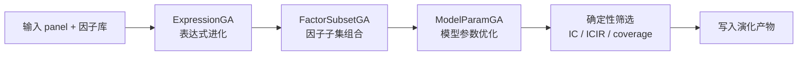
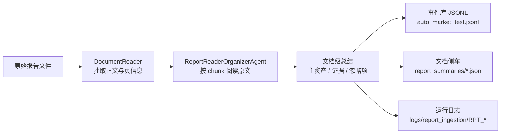

# 多智能体因子挖掘平台

这是一个把 **LLM 智能体协作** 和 **确定性量化研究层** 拆开实现的因子挖掘项目。

LLM 负责提出假设、设计因子、验证表达式、调用回测、压缩反馈；确定性代码负责因子计算、预处理、筛选、模型评估、批量回测和结果沉淀。项目已经支持 `crypto / stock / futures` 三类市场，并加入了本地非结构化报告入库能力。

---

## 1. 项目简介

项目目标是围绕 `data/panel_data.parquet` 构建一个可持续迭代的因子研究闭环：

- LLM 先提出研究方向和候选因子。
- 确定性研究层验证表达式是否合法、是否可计算、是否值得继续。
- 通过回测或筛选把高质量因子沉淀进本地因子库。
- 通过日志、轨迹池、知识库和负面知识，不断压缩重复探索成本。

当前默认面向横截面市场数据，并通过 `market_type` 和 domain adapter 扩展到：

- `crypto`
- `stock`
- `futures`

同时，项目新增了非结构化报告入库能力，可以把本地 PDF / DOCX / HTML / TXT / MD 报告整理成下游可读的结构化市场文本。

---

## 2. 三个运行模式 + 非结构化报告提取

### 2.1 🚀 `mining`

这是主工作流，也是 LLM 参与最深的模式。

**输入**
- `data/panel_data.parquet`
- 可选市场文本：`--text-data-path`
- 可选市场类型：`--market-type crypto|stock|futures`

**过程**


**输出**
- `logs/alpha_factor_mining_loop/<run_id>/`
- `factor_library/` 里的沉淀因子
- `artifacts/trajectory_pool.json`
- 结构化日志与原始 LLM I/O

### 2.2 ⚙️ `evolution`

这是纯确定性的因子优化模式，主要做遗传优化。

**输入**
- `data/panel_data.parquet`
- 因子库
- 可选 GA 参数：`--evolve-target factor|model_params`

**过程**



**输出**
- `logs/evolution_loop/EVO_*/`
- `factor_library/raw/mutated_factors_library.json`
- `factor_library/wiki/evolved_factors/`
- `factor_library/raw/model_params/`

### 2.3 🧪 `batch-backtest`

这是最终验证模式，负责把已筛选的因子或因子组合放到更重的评估流程里。

**输入**
- 结构化 panel
- 已沉淀的因子库
- 可选阈值：`--min-factors`, `--ic-threshold`, `--icir-threshold`

**过程**


**输出**
- `results/batch_backtest/BATCH_*/`
- `logs/batch_backtest/BATCH_*/`

### 2.4 📚 非结构化报告提取

这个流程不是新的运行模式，而是给 `mining` 提供更好的输入来源。

**输入**
- `data/unstructured/reports/` 下的 PDF / DOCX / HTML / TXT / MD

**过程**



**输出**
- `data/unstructured/auto_market_text.jsonl`
- `data/unstructured/report_summaries/`
- `logs/report_ingestion/RPT_*/`

`agent` 是默认提取方式；如果 LLM 请求失败，会自动回退到 `rules`。

---

## 3. 快速开始

### 3.1 安装

```bash
pip install -e .
```

### 3.2 准备环境

最小 `.env` 示例：

```env
LLM_PROVIDER=zhipu
ZHIPU_API_KEY=your_api_key
ZHIPU_MODEL=glm-4-flash
```

常见 provider：

| Provider | 必需变量 | 常用可选变量 |
| --- | --- | --- |
| `zhipu` | `ZHIPU_API_KEY` | `ZHIPU_MODEL`, `LLM_MODEL` |
| `azure_openai` | `AZURE_OPENAI_API_KEY`, `AZURE_OPENAI_ENDPOINT`, `AZURE_OPENAI_API_VERSION` | `AZURE_OPENAI_DEPLOYMENT`, `LLM_MODEL` |
| `openai-compatible` | `OPENAI_API_KEY`, `LLM_MODEL` | `OPENAI_BASE_URL` |

`AGENT_MODEL_MAP` 可以是 JSON，对不同 agent 指定不同模型。

### 3.3 `mining` 模式

默认面向 crypto：

```bash
python3 main.py --mode mining \
  --loop-count 1 \
  --panel-data-path data/panel_data.parquet
```

如果你有本地新闻、公告、研报、社媒整理后的文本，可以一起接入：

```bash
python3 main.py --mode mining \
  --loop-count 1 \
  --panel-data-path data/panel_data.parquet \
  --text-data-path data/unstructured/auto_market_text.jsonl \
  --market-type crypto
```

如果你做的是股票或期货，只要准备好同样格式的 panel，就可以切换：

```bash
python3 main.py --mode mining \
  --loop-count 1 \
  --panel-data-path data/stock_panel.parquet \
  --market-type stock
```

```bash
python3 main.py --mode mining \
  --loop-count 1 \
  --panel-data-path data/futures_panel.parquet \
  --market-type futures
```

### 3.4 `evolution` 模式

优化表达式因子：

```bash
python3 main.py --mode evolution \
  --evolve-target factor \
  --factor-ga-mode hybrid \
  --num-generations 5 \
  --population-size 5 \
  --panel-data-path data/panel_data.parquet
```

只做模型参数优化：

```bash
python3 main.py --mode evolution \
  --evolve-target model_params \
  --num-generations 5 \
  --population-size 5 \
  --panel-data-path data/panel_data.parquet
```

### 3.5 `batch-backtest` 模式

```bash
python3 main.py --mode batch-backtest \
  --panel-data-path data/panel_data.parquet \
  --min-factors 10 \
  --ic-threshold 0.003 \
  --icir-threshold 0.02
```

如果你更想直接调用脚本，也可以：

```bash
python3 scripts/run_batch_backtest.py \
  --panel-data data/panel_data.parquet \
  --min-factors 10
```

### 3.6 非结构化报告入库

把原始报告放进 `data/unstructured/reports/`，然后执行：

```bash
python3 scripts/ingest_unstructured_reports.py \
  --input-dir data/unstructured/reports \
  --output data/unstructured/auto_market_text.jsonl \
  --panel-data-path data/panel_data.parquet \
  --market-type crypto \
  --extractor agent
```

如果你只是想离线跑通解析，不依赖 LLM：

```bash
python3 scripts/ingest_unstructured_reports.py \
  --input-dir data/unstructured/reports \
  --output data/unstructured/auto_market_text.jsonl \
  --panel-data-path data/panel_data.parquet \
  --market-type crypto \
  --extractor rules
```

---

## 4. 项目架构

### 4.1 代码结构

```text
.
├── main.py                       三种运行模式的统一入口
├── configs/
│   ├── qlib/                     回测与数据接口相关配置
│   └── domain_adapter.yaml       crypto / stock / futures 域配置
├── scripts/                      运行脚本、GA、回测、非结构化入库
├── src/
│   ├── adapters/                 panel / domain / market text 适配
│   ├── agents/                   LLM 智能体与报告阅读整理 agent
│   ├── core/                     Agent 基类、编排器、上下文策略与存储
│   ├── factor_runtime/           表达式 DSL、验证器、GA、质量门禁
│   ├── infra/                    结构化日志与轻量存储
│   ├── llm/                      provider、gateway、retry、cache
│   ├── prompts/                  prompt、模板、代码生成模板
│   ├── schemas/                  共享 DTO
│   ├── trading_agents_research/  确定性研究层：计算、预处理、筛选
│   └── workflows/                mining loop、runtime、context policy
├── data/                         panel 数据与非结构化入库目录
├── factor_library/               已接受因子、演化因子、负面知识
├── logs/                         各模式运行日志
├── results/                      batch-backtest 的最终结果
├── tests/                        unittest 覆盖
└── docs/                         模式说明、数据接口说明、设计文档
```

### 4.2 分层职责

这个项目的核心分层是：

1. **LLM / Agent 层**
   - 提出方向
   - 拆解任务
   - 生成候选因子
   - 解释结果和反馈

2. **确定性研究层**
   - 表达式解析
   - 因子计算
   - 预处理
   - 指标筛选
   - GA 进化
   - 批量验证

3. **数据与资产层**
   - `data/panel_data.parquet`
   - `data/unstructured/auto_market_text.jsonl`
   - `factor_library/`
   - `logs/`
   - `results/`

### 4.3 运行数据流

```text
panel_data.parquet
    ├──> mining -> hypothesis -> factor design -> backtest -> feedback
    ├──> evolution -> deterministic GA -> accepted factors
    └──> batch-backtest -> model training -> qlib/report artifacts

raw reports
    └──> ingest_unstructured_reports.py
            ├──> report_summaries/*.json
            ├──> logs/report_ingestion/RPT_*/
            └──> auto_market_text.jsonl
                    └──> mining mode
```

---

## 5. 数据格式与表达式

### 5.1 Panel 数据

默认数据文件：

```text
data/panel_data.parquet
```

预期格式：

- `MultiIndex`: `datetime`, `symbol`
- 常见特征列：
  `open`, `high`, `low`, `close`, `volume`, `vwap`, `funding_rate`,
  `open_interest`, `oi_change_pct`, `long_liq`, `short_liq`
- 目标列：
  `returns_1d`, `returns_3d`, `returns_5d`, `returns_10d`

### 5.2 文本特征

在 `mining` 模式下，`--text-data-path` 可以传入本地 JSONL / CSV 市场文本。
默认会生成这些文本特征：

- `news_count`
- `news_sentiment_score`
- `risk_event_count`
- `policy_event_flag`
- `liquidity_event_score`

### 5.3 表达式 DSL

因子表达式使用 `$column` 形式引用列，并调用 `src/factor_runtime/function_lib.py` 中的函数。

示例：

```python
"$close / TS_MEAN($close, 24) - 1"
"RANK($volume) - RANK($close)"
"DELTA($close, 5) / TS_STD($close, 20)"
```

表达式预校验会拒绝：

- 不存在的 `$column`
- 未支持的函数，比如 `TS_SKEW`, `EMA`, `SMA`, `POW`, `SQRT`, `FILTER`
- 比较逻辑与离散条件函数
- 小于 2 或大于 120 的时序窗口

---

## 6. 开发与验证

常用测试：

```bash
python3 -m unittest tests.test_research_pipeline -v
PYTHONPATH=src python3 -m unittest tests.test_evolution_ga -v
python3 -m unittest tests.test_unstructured_report_ingestion -v
python3 -m unittest discover -s tests -v
```

常用调试命令：

```bash
python3 main.py --loop-count 1 --debug
PYTHONPATH=src python3 scripts/run_factor_evolution.py \
  --num-generations 2 \
  --population-size 2 \
  --evolve-target factor
python3 scripts/test_validator.py
```

---

## 7. 深入阅读

- `docs/data_interface.md`
- `docs/mode_mining.md`
- `docs/mode_evolution.md`
- `docs/mode_batch_backtest.md`
