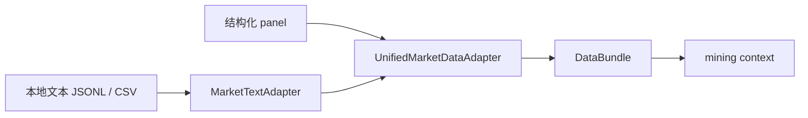

# Data Interface：统一 panel 与文本特征接口

这个文档说明项目的轻量数据接口。它不是新的运行 mode，而是给 `mining` 提供一个更清晰的数据入口。

---

## 1. 目标

这个接口做两件事：

1. 把结构化市场数据统一成项目内部可执行的 panel
2. 把本地市场文本整理成可以和 panel 对齐的文本特征

简化理解：

- `panel_data.parquet` 是主数据
- `--text-data-path` 是辅助文本输入
- `mining` 会拿到合并后的 `data_bundle`
- `evolution` 和 `batch-backtest` 继续只看结构化 panel 和因子库

---

## 2. 入口与全部 CLI

### 2.1 最常用的入口

```bash
python3 main.py --mode mining \
  --loop-count 1 \
  --panel-data-path data/panel_data.parquet \
  --text-data-path data/unstructured/auto_market_text.jsonl
```

### 2.2 适合 data interface 的参数

- `--panel-data-path`：主 panel 路径
- `--text-data-path`：本地文本 JSONL / CSV
- `--market-type`：`crypto | stock | futures`
- `--domain-config`：域配置 YAML
- `--symbol-alias-path`：symbol 别名映射
- `--debug-symbol-count`：debug panel 的 symbol 上限
- `--debug-time-steps`：debug panel 的时间步上限
- `--write-data-artifacts`：即使没有文本，也写出 `data_bundle`

### 2.3 非结构化报告入库入口

```bash
python3 scripts/ingest_unstructured_reports.py \
  --input-dir data/unstructured/reports \
  --output data/unstructured/auto_market_text.jsonl \
  --panel-data-path data/panel_data.parquet \
  --market-type crypto \
  --extractor agent
```

`agent` 是默认方式，`rules` 是离线 fallback。

---

## 3. 目标流程



### 文本对齐怎么做

- 先读取 `timestamp` 和 `symbol`
- 再按 panel 的 bar 时间对齐
- 最后做 left join，把文本特征挂到 `(datetime, symbol)` 上

### 默认文本特征

- `news_count`
- `news_sentiment_score`
- `risk_event_count`
- `policy_event_flag`
- `liquidity_event_score`

---

## 4. 日志和产物

当开启 data interface 或文本输入后，会写出这些产物：

- `data_bundle/merged_panel.parquet`
- `data_bundle/debug_panel.parquet`
- `data_bundle/source_data_desc.md`
- `data_bundle/feature_schema.json`

在 `mining` 里，这些内容会落到：

- `logs/alpha_factor_mining_loop/<run_id>/data_bundle/`

对于非结构化报告入库，还会额外生成：

- `data/unstructured/report_summaries/*.json`
- `logs/report_ingestion/RPT_*/summary.json`
- `logs/report_ingestion/RPT_*/progress.jsonl`
- `logs/report_ingestion/RPT_*/loop_*.json`

---

## 5. 适用场景

适合：

- 你有一批新闻、公告、研报、社媒文本
- 你想让 `mining` 看到文本背景
- 你想让股票 / 期货 / crypto 使用同一套数据接口

不适合：

- 让 `evolution` 直接读原始文本
- 让 `batch-backtest` 直接读原始文本
- 把没有 `timestamp` / `symbol` 的杂乱文本直接丢进来

---

## 6. 配置

默认配置文件：

```text
configs/data_interface.yaml
```

支持通过环境变量覆盖：

```env
DATA_INTERFACE_CONFIG_PATH=configs/data_interface.yaml
```

可以配置：

- 输出文本特征列
- 必需输入字段
- 正向 / 负向 / 风险 / 政策 / 流动性词典

如果配置文件缺失或格式错误，系统会回退到内置默认值，并把原因写入 `DataBundle.warnings`。
