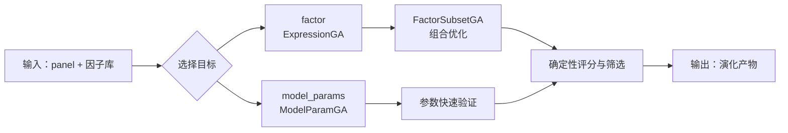

# Evolution Mode：因子优化 / 参数优化

`evolution` 是项目的纯确定性优化模式。它负责把候选因子做得更好，但不负责最终 batch 回测。

---

## 1. 目标

这个 mode 主要做两件事：

1. **factor**：优化表达式因子和因子子集
2. **model_params**：优化模型参数

一句话理解：

> `evolution = 快速搜索 + 确定性筛选 + 因子沉淀`

它不直接读原始文本，也不做最终 batch-backtest。

---

## 2. 入口与全部 CLI

### 2.1 主入口

```bash
python3 main.py --mode evolution --evo-generations 5 --evo-population 5
```

### 2.2 脚本入口

```bash
python3 scripts/run_factor_evolution.py --evolve-target factor --factor-ga-mode hybrid
```

### 2.3 重点参数

- `--evolve-target`：`factor | model_params`
- `--factor-ga-mode`：`hybrid | expression | subset`
- `--ga-mode`：旧参数别名
- `--num-generations` / `--evo-generations`：代数
- `--population-size` / `--evo-population`：种群规模
- `--elite-size`：精英保留
- `--tournament-k`：锦标赛选择规模
- `--candidate-pool-size`：候选池上限
- `--mutation-rate`：变异率
- `--crossover-rate`：交叉率
- `--min-factor-fitness`：入库阈值
- `--min-factor-coverage`：覆盖率阈值
- `--min-factor-rank-ic-abs`：Rank IC 阈值
- `--min-subset-factors` / `--max-subset-factors`：subset 规模边界
- `--target-subset-factors`：subset 目标规模
- `--disable-llm-screening`：关闭 LLM lessons 蒸馏

---

## 3. 目标流程



### factor 模式怎么跑

- 先从种子因子库拿初始 population
- 再做表达式交叉 / 变异 / 修复
- 然后进行 deterministic fitness 评估
- 最后把高质量因子写回本地库

### model_params 模式怎么跑

- 从候选因子池出发
- 进化模型参数染色体
- 在本地 panel 上做快速验证
- 输出最优参数配置

---

## 4. 细节：factor 目标到底怎么演化

### 4.1 种子怎么来

`EvolutionRunner` 会先从以下库读取因子：

- `factor_library/raw/all_factors_library.json`
- `factor_library/raw/mutated_factors_library.json`

然后按表达式去重，形成 seed population。

### 4.2 ExpressionGA 是什么

ExpressionGA 负责表达式级别的演化。它做的事情包括：

- 初始种群评估
- elite retention
- tournament selection
- crossover
- mutation
- 表达式修复
- 表达式校验
- fitness 计算

### 4.3 tournament 怎么工作

tournament selection 的逻辑很简单：

1. 每次随机抽 `tournament_k` 个候选
2. 比较它们的 fitness
3. 选 fitness 最好的那个当父代

这样做的结果是：

- 强个体更容易被保留
- 但不会完全变成“只看全局第一名”
- 搜索空间仍然保留多样性

### 4.4 elite retention 怎么工作

每一代先把 fitness 最好的前 `elite_size` 个直接复制到下一代。

作用：

- 防止好表达式在交叉/变异中丢失
- 让收敛更稳定

### 4.5 crossover 和 mutation 怎么工作

- `crossover_rate` 决定是否做交叉
- `mutation_rate` 决定是否做变异

交叉和变异后，表达式会再经过一轮修复与校验，包括：

- 未知列
- 未知函数
- 递归归一化
- 自除 / 自减
- AST 节点数过多
- 窗口参数是否在 `2 ~ 120`

### 4.6 fitness 怎么算

当前快速 fitness 主要看：

- Rank IC
- ICIR
- long-short IR
- coverage
- positive IC ratio
- turnover
- complexity
- overfit 惩罚

### 4.7 通过阈值后会去哪里

通过 deterministic 阈值的新表达式会写入：

- `factor_library/raw/mutated_factors_library.json`

然后再同步到：

- `factor_library/wiki/evolved_factors/`

---

## 5. 细节：factor 子集模式怎么跑

### 5.1 subset 的意思

subset 模式不是再发明新表达式，而是在候选表达式里挑组合。

### 5.2 mask 是什么

mask 是一个二进制选择器：

- `11111`：全选
- `10101`：选第 1、3、5 个
- `00111`：选后 3 个

### 5.3 repair_mask() 做什么

`repair_mask()` 只负责把 mask 修到合法范围，不负责判断质量。

它会保证：

- 至少选 `min_subset_factors`
- 最多选 `max_subset_factors`

### 5.4 subset signal 怎么算

当前组合信号的定义是：

1. 对每个被选因子做横截面 rank
2. 再对这些 rank 取均值

这会让 subset GA 变成“组合信号搜索”，而不是简单拼接。

### 5.5 subset 的 fitness 怎么算

组合 fitness 仍然使用统一的 `compute_ga_fitness()`，但会额外加上：

- size penalty
- correlation penalty

### 5.6 subset 的输出

subset GA 的结果只属于当前 run 的 artifact，不会直接污染单因子库。

典型输出：

- `best_subset.json`
- `best_factors.txt`

---

## 6. 细节：model_params 目标怎么跑

当 `--evolve-target model_params` 时，优化对象变成模型参数，而不是表达式。

### 6.1 参数染色体

当前本地实现主要使用 LightGBM 参数空间，例如：

- `learning_rate`
- `max_depth`
- `num_leaves`
- `lambda_l1`
- `lambda_l2`
- `min_data_in_leaf`
- `feature_fraction`
- `bagging_fraction`

### 6.2 演化方式

仍然使用 GA 的经典套路：

- elite retention
- tournament selection
- crossover
- mutation

但染色体不是因子表达式，而是参数字典。

### 6.3 输出

最终会写出：

- `best_model_params.json`
- `model_param_population.csv`
- `model_param_summary.json`

并把最优参数复制到：

- `factor_library/raw/model_params/`

---

## 7. 日志和产物

常见产物：

- `logs/evolution_loop/EVO_*/progress.jsonl`
- `logs/evolution_loop/EVO_*/structured.jsonl`
- `logs/evolution_loop/EVO_*/memory_context.json`
- `logs/evolution_loop/EVO_*/population.csv`
- `logs/evolution_loop/EVO_*/candidate_pool.json`
- `logs/evolution_loop/EVO_*/best_subset.json`
- `logs/evolution_loop/EVO_*/best_factors.txt`
- `logs/evolution_loop/EVO_*/accepted_factors.json`
- `logs/evolution_loop/EVO_*/best_model_params.json`
- `logs/evolution_loop/EVO_*/model_param_population.csv`
- `logs/evolution_loop/EVO_*/model_param_summary.json`
- `logs/evolution_loop/EVO_*/evolution_wiki_summary.json`

你通常会优先看：

1. `progress.jsonl`：每代有没有正常推进
2. `candidate_pool.json`：候选池长什么样
3. `accepted_factors.json`：最后谁进库了
4. `best_model_params.json`：参数优化结果
5. `evolution_wiki_summary.json`：wiki 和知识提炼是否成功

### 7.1 evolution wiki 是什么

`evolution` 运行结束后，会把通过阈值的演化因子同步到：

- `factor_library/wiki/evolved_factors/index.md`
- `factor_library/wiki/evolved_factors/<run_id>/`

它的作用是给“演化出来的因子”单独做门户，方便浏览父代、代数、表达式和指标。

### 7.1.1 这些文件怎么成为后续输入

`evolution` 当前对 wiki 的使用分成两层：

1. **机器层输入**
   - `factor_library/raw/evolved/distilled_lessons_evolution.md`
   - 由 `distill_evolution_knowledge.py` 从最近失败样本中提炼
   - 由 `EvolutionConfig.lessons_path` 指向
   - 作用是给后续演化提供“不要重复犯哪些错”的长期记忆

2. **人类可读门户**
   - `factor_library/wiki/evolved_factors/index.md`
   - `factor_library/wiki/evolved_factors/<run_id>/`
   - 作用是把通过阈值的演化因子整理成可浏览的知识页

当前代码里，这两个部分都已经生成；而且 **evolution 在启动前也会先加载同一套长期记忆快照**：

- `factor_library/wiki/log.md`
- `factor_library/wiki/evolved_factors/index.md`
- `factor_library/raw/evolved/evolution_failures.jsonl`
- `factor_library/raw/evolved/distilled_lessons_evolution.md`

这些内容会先汇总成 `logs/evolution_loop/EVO_*/memory_context.json`，再用于：

- seed 的优先级排序
- candidate 的先验筛选
- run summary 的知识回看

当前默认仍然是“结构化记忆输入 + 确定性 GA”，不是整棵 wiki 的全文检索。后者如果要做，可以再加一层检索器，但不影响现在这条主链路。

### 7.2 evolution 负面知识怎么来

`evolution` 还会把失败样本提炼成：

- `factor_library/raw/evolved/distilled_lessons_evolution.md`

这些教训会反向回灌到后续演化和假设阶段，避免重复撞同样的坑。

### 7.3 这些文件怎么作为 input

目前 `evolution` 的“长期记忆输入”主要是：

- `factor_library/wiki/log.md`
- `factor_library/wiki/evolved_factors/index.md`
- `factor_library/raw/evolved/distilled_lessons_evolution.md`
- `factor_library/raw/evolved/evolution_failures.jsonl`

它们分别承担：

- **成功记忆层**：告诉 evolution 哪些因子已经被验证过，优先从这些结构延展
- **失败记忆层**：告诉 evolution 哪些重组套路、哪些表达式形态已经踩坑
- **摘要层**：让后续演化知道最近哪些 recombination、哪些参数空间不值得再试
- **证据层**：保留失败样本原始记录，方便重建 wiki 或重新提炼 lessons

如果你从 `scripts/run_factor_evolution.py` 走默认路径，这些文件会在 postprocess 阶段自动更新；如果你只跑脚本但禁用了 LLM screening，就会只更新 wiki，不再做人类摘要提炼。

---

## 8. 适用场景

适合：

- 因子已经有一批候选，想快速筛更好的
- 想做表达式搜索和组合搜索
- 想做模型参数优化，但不想先跑重回测

不适合：

- 你还在做对话式研究
- 你还想让 LLM 参与每一步判断
- 你要立刻得到最终 batch-backtest 报告
