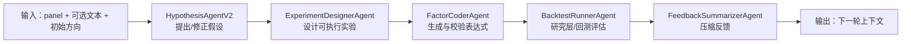
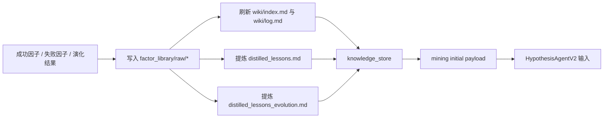

# Mining Mode：多智能体因子挖掘

`mining` 是项目的主工作流。它负责让 LLM 智能体围绕同一个研究方向持续迭代：提出假设、设计实验、生成因子、评估结果、压缩反馈。

---

## 1. 目标

这个 mode 的目标是：

- 让研究过程可对话、可回放、可持续迭代
- 让 LLM 专注于“研究判断”，把计算和回测交给确定性层
- 把每轮结果压缩成下一轮更好的上下文

一句话理解：

> `mining = 研究假设生成 + 因子设计 + 因子验证 + 反馈沉淀`

---

## 2. 入口与全部 CLI

### 2.1 主入口

```bash
python3 main.py --mode mining --loop-count 1
```

### 2.2 脚本入口

```bash
python3 scripts/run_alpha_factor_mining_loop.py --loop-count 1
```

### 2.3 最常用参数

- `--loop-count`：跑多少轮
- `--panel-data-path`：结构化 panel 路径
- `--text-data-path`：可选市场文本输入
- `--market-type`：`crypto | stock | futures`
- `--domain-config`：域配置
- `--symbol-alias-path`：symbol 别名
- `--initial-direction`：初始研究方向
- `--initial-hypothesis`：初始假设文本
- `--debug-symbol-count`：debug panel symbol 上限
- `--debug-time-steps`：debug panel 时间步上限
- `--write-data-artifacts`：写出 `data_bundle`
- `--stop-on-error`：遇错是否停止
- `--retry-per-round`：单轮失败重试次数
- `--debug`：更详细日志

---

## 3. 目标流程



### 一轮里具体做什么

- **HypothesisAgentV2**：结合历史反馈和负面知识，提假设
- **ExperimentDesignerAgent**：把假设拆成候选因子和任务计划
- **FactorCoderAgent**：检查表达式是否合法、能不能算
- **BacktestRunnerAgent**：调用研究层或回测引擎评估
- **FeedbackSummarizerAgent**：把结果压成下一轮能用的知识

---

## 4. 每个 Agent 的输入与输出

### 4.1 HypothesisAgentV2

**输入**

- `scenario`
- `direction`
- `initial_hypothesis`
- `rag_text`
- `distilled_knowledge`
- `hypothesis_feedback_history`
- `rejected_factors`

**输出**

- `hypothesis`
- `hypothesis_reasoning`
- `hypothesis_structured`

**它做的事**

- 从历史反馈里找方向
- 结合负面知识和过去失败经验
- 生成新假设或修正假设

---

### 4.2 ExperimentDesignerAgent

**输入**

- `scenario`
- `hypothesis`
- `available_features`
- `data_time_step`
- `data_time_step_description`
- `hypothesis_feedback_history`
- `rag_text`
- `previous_factor_names`

**输出**

- `experiment_spec`
- `task_plan`
- `experiment_id`
- `qlib_factor_experiment`
- `preprocess_decision`

**它做的事**

- 把假设拆成可执行的因子实验
- 为每个候选因子生成表达式、描述、变量
- 检查重复命名和表达式约束
- 生成预处理决策，比如是否启用中性化、如何补齐

---

### 4.3 FactorCoderAgent

**输入**

- `scenario`
- `experiment_spec`
- `task_plan`
- `available_features`
- `panel_data_path`
- `rejected_factor_failures`
- `hypothesis`
- `hypothesis_structured`

**输出**

- `factor_implementation`
- `calculation_report`
- `qlib_factor_experiment`

**它做的事**

- 把实验设计落成可执行实现
- 校验表达式能不能解析、能不能执行
- 检查生成值是否有效、覆盖率是否足够
- 记录每个 factor 的生成/失败状态

---

### 4.4 BacktestRunnerAgent

**输入**

- `factor_implementation`
- `calculation_report`
- `qlib_factor_experiment`
- `panel_data_path`
- `target_column`
- `available_features`
- `market_type`

**输出**

- `backtest_report`
- `metrics`
- `qlib_factor_experiment`

**它做的事**

- 先尝试 Qlib 主路径
- 再退到 `ResearchPipeline` deterministic fallback
- 最后生成因子级 / 组合级指标

**常见指标**

- `IC`
- `ICIR`
- `Rank IC`
- `Rank ICIR`
- `coverage`
- `turnover`
- `sharpe`
- `annualized_return`
- `information_ratio`
- `max_drawdown`

---

### 4.5 FeedbackSummarizerAgent

**输入**

- `hypothesis`
- `experiment_spec`
- `factor_implementation`
- `calculation_report`
- `backtest_report`
- `metrics`
- `hypothesis_feedback_history`

**输出**

- `feedback`
- `next_hypothesis_hint`
- `distilled_knowledge`
- `hypothesis_feedback_history`

**它做的事**

- 汇总本轮结果
- 解释成功和失败原因
- 提炼下一轮要避开的模式
- 生成可写回上下文的长期知识

---

## 5. LLM wiki / 长期记忆输入

这里的“LLM wiki”不是单个文件，而是一组由统一知识入口整理出来的长期记忆。`mining` 不是把整棵 `factor_library/wiki/` 全量塞给 agent，而是把成功经验、失败经验和最近演化教训压缩后送进初始 payload。

### 5.1 长期记忆实际来自哪些文件

当前 `mining` 通过 `knowledge_store.load_for_mining()` 读取这些来源：

- `factor_library/raw/negative_knowledge/distilled_lessons.md`
- `factor_library/wiki/index.md`
- `factor_library/wiki/log.md`
- `factor_library/raw/all_factors_library.json`
- `factor_library/raw/mutated_factors_library.json`
- `factor_library/raw/evolved/evolution_failures.jsonl`
- `factor_library/raw/evolved/distilled_lessons_evolution.md`

其中：

- `index.md` / `log.md` 提供成功因子的目录和最近发现
- `all_factors_library.json` 提供主成功因子库快照
- `mutated_factors_library.json` 提供演化成功因子快照
- `distilled_lessons.md` 提供 mining 侧失败经验摘要
- `evolution_failures.jsonl` + `distilled_lessons_evolution.md` 提供 evolution 侧最近失败样本和压缩教训

### 5.2 它怎么进入 HypothesisAgent

`HypothesisAgentV2` 看到的不是“wiki 文件列表”，而是 `CrossSectionDomainAdapter.build_initial_payload()` 组装好的结构化上下文。

当前会进入初始 payload 的长期记忆字段包括：

- `distilled_knowledge`
- `evolution_distilled_knowledge`
- `success_factor_memory`
- `evolution_success_factor_memory`
- `evolution_failure_memory`
- `long_term_memory`
- `knowledge_source_paths`
- `knowledge_counts`
- `knowledge_warnings`

此外还会一起进入：

- `rag_text`：当前 panel 场景摘要
- `available_features`：当前可用结构化特征
- `hypothesis_feedback_history`：最近几轮的短期反馈轨迹
- `rejected_factors`：近期被拒绝因子的失败原因

所以可以把 `mining` 的记忆理解成两层：

- 短期记忆：
  当前 run 中每一轮的 `feedback`、`next_hypothesis_hint`、`hypothesis_feedback_history`
  每 5 轮还会做一次更强的失败经验蒸馏，把重复出现的问题压回长期知识
- 长期记忆：
  `knowledge_store` 从 `factor_library/raw/*` 和 `factor_library/wiki/*` 提取出来的成功经验、失败经验和演化经验

### 5.3 这些知识怎么变成长久记忆

`factor_library/wiki/` 本身是可浏览的知识门户，但真正喂给 agent 的，是统一知识入口压缩后的字段：



当前链路里，长期记忆主要体现在：

- 成功经验会不断进入 `all_factors_library.json`
- 演化成功经验会不断进入 `mutated_factors_library.json`
- mining 失败经验会沉淀到 `distilled_lessons.md`
- evolution 失败经验会沉淀到 `evolution_failures.jsonl` 和 `distilled_lessons_evolution.md`
- `wiki/index.md` 与 `wiki/log.md` 会把主成功因子和演化因子统一整理成可读门户

### 5.4 它怎么更新

`mining` 每轮结束后，会做两类更新：

1. **成功知识**
   - 合格因子会写入 `factor_library/raw/all_factors_library.json`
   - 同步刷新 `factor_library/wiki/index.md`、`factor_library/wiki/log.md` 与 `factor_library/wiki/factors/`
2. **失败知识**
   - 失败样本会写入负面知识库
   - 由 `distill_negative_knowledge.py` 汇总成 `distilled_lessons.md`
   - 不再维护 `wiki/failures/` 这种大目录，失败经验主要保留在 `all_failures.jsonl` 和 `distilled_lessons.md`

### 5.5 你该看什么

- 想看最近发现了什么因子：看 `factor_library/wiki/log.md`
- 想看某个因子背后的假设：看 `factor_library/wiki/hypotheses/`
- 想看某个因子的公式和指标：看 `factor_library/wiki/factors/`
- 想看完整失败记录：看 `factor_library/raw/negative_knowledge/all_failures.jsonl`
- 想看 agent 实际会吸收的失败经验：看 `factor_library/raw/negative_knowledge/distilled_lessons.md`
- 想看 agent 实际会吸收的演化教训：看 `factor_library/raw/evolved/distilled_lessons_evolution.md`

### 5.6 为什么要有 wiki

因为只看日志太散，只看 JSON 因子库又太冷。wiki 的作用是把“发现过程”变成“知识目录”，再由 `knowledge_store` 把目录压缩成 agent 真正能用的长期记忆。

### 5.7 如果你想把 wiki 页面直接喂给 agent

当前实现默认不会把整页 wiki 全量拼进 prompt；如果你希望增强检索，可以在构造 `rag_text` 时把：

- `factor_library/wiki/index.md`
- `factor_library/wiki/log.md`
- `factor_library/wiki/hypotheses/*.md`
- `factor_library/wiki/factors/*.md`

选取一部分摘要后拼接进去。现在的代码已经提供了 `rag_text` 这个插槽，所以这种增强是低成本的。

---

## 6. 日志和产物

`mining` 运行后，通常会得到这些东西：

- `logs/alpha_factor_mining_loop/<run_id>/progress.jsonl`
- `logs/alpha_factor_mining_loop/<run_id>/structured.jsonl`
- `logs/alpha_factor_mining_loop/<run_id>/llm_raw_io.jsonl`
- `logs/alpha_factor_mining_loop/<run_id>/loop_###.json`
- `logs/alpha_factor_mining_loop/<run_id>/data_bundle/`
- `artifacts/trajectory_pool.json`
- `factor_library/`

你通常会优先看：

1. `progress.jsonl`：有没有跑起来
2. `loop_###.json`：这一轮到底做了什么
3. `llm_raw_io.jsonl`：是不是 prompt / provider 出了问题
4. `factor_library/wiki/`：结果有没有沉淀成知识

---

## 7. 适用场景

适合：

- 想持续探索新因子
- 想保留研究对话和每轮反馈
- 想让 LLM 负责“研究判断”

不适合：

- 批量搜索很多表达式
- 大规模 GA 优化
- 最终的集中模型训练和组合回测

---

## 8. 和其他 mode 的边界

- `mining`：负责研究闭环
- `evolution`：负责因子 / 参数优化
- `batch-backtest`：负责最终验证
- 非结构化报告入库：只给 `mining` 提供更好的上下文
